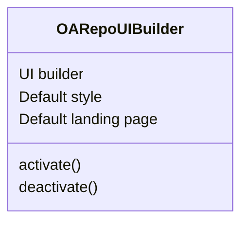
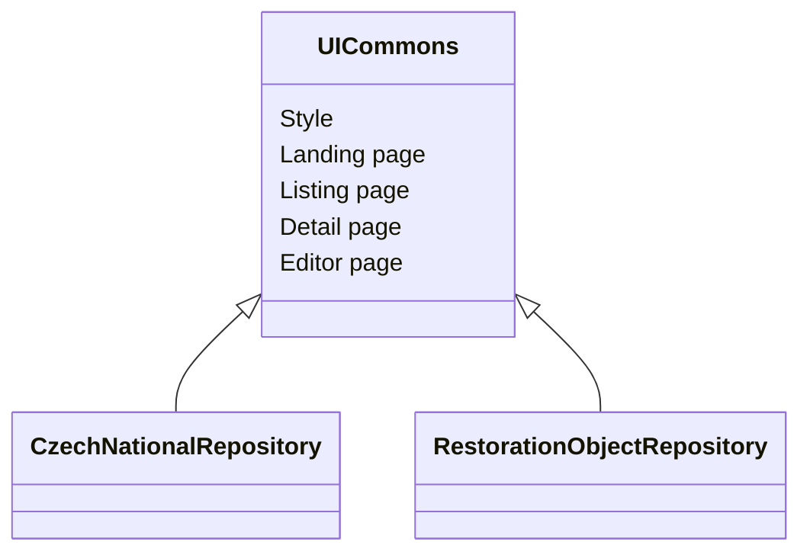
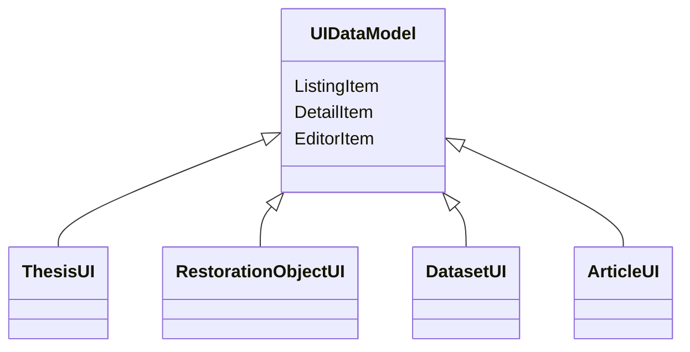

# OARepo UI builder

This package provides an integrated UI builder
for OARepo-based applications.

OARepo is a set of Invenio libraries for creating
repositories. This UI builder provides an extensible
framework for adding custom metadata models to
repository UI and for UI customization, including
landing page, CSS and others.

## Philosophy

OARepo SPA UI is always written in Quasar/Javascript/Typescript,
other frontend technologies are not supported by this builder.

An application is built from this NPM module and modules that  
implement styling,







## Usage

To start working on a repository, create your own
npm package containing the UI - landing pages,
css, images etc.

Either build and install the package or link the 
package via npm/yarn link into this builder.

Then call within this module:

```bash
npm run activate <name of the package> <name of another package>

or

yarn activate <name of the package> <name of another package>
```

This command will prepare the system. Then run dev/build as usual.

To perform cleanup, run

```bash
npm run deactivate
```

### UI Module structure

The UI module structure must provide 
an entrypoint in module format (
for example, index.mjs or plugin.mjs,
plugin.ts) 
that exposes 'UIPlugin' export. This 
file is loaded during the activate/deactivate
process and is also included in the final build.

Note that the file is run within esrun -
that means that only javascript/typescript is
allowed in the file or its imports.

**Note**: You can not directly import .vue SFC from this
file. To register components, use code splitting
with () => import(...) syntax.

## Pages

To define a page, use the following syntax:

```javascript
export const UIPlugin = {
    pages: [
        {
            name: 'pagename',
            component: () => import('./Pages/Page.vue'),
            path: 'mostly not needed but you are free to provide one',
            usages: [
                // this part is used to generate the path and 
                // insert the correct layout
                {
                    // one of landing, listing, detail, edit
                    type: 'landing',
                    // one of false (use without community), 
                    // true (use with any community),
                    // string (use with this community)
                    // string[] (use with these communities)
                    community: false,
                    // one of false (use without datamodel), 
                    // one of true (use with any datamodel),
                    // string (use with this datamodel)
                    // string[] (use with these datamodels)
                    datamodel: false
                }
            ],
            layout: 'layout name, usually not needed',
            partition: 'partition name, usually not needed'
        }
    ]
}
```


## Layouts

Layouts are defined with this syntax:

```javascript
export const UIPlugin = {
    layouts: [
        {
            name: 'default',
            component: () => import('./layouts/DefaultLayout.vue'),
            usages: [
                {
                    // one of landing, listing, detail, edit
                    type: 'landing',
                    // one of false (use without community), 
                    // true (use with any community),
                    // string (use with this community)
                    // string[] (use with these communities)
                    community: false,
                    // one of false (use without datamodel), 
                    // one of true (use with any datamodel),
                    // string (use with this datamodel)
                    // string[] (use with these datamodels)
                    datamodel: false
                }
            ]
        }
    ]
}
```

The layout section will be converted into Router
configuration. Note that it does not define a path -
that will be added automatically when a Page is created
(for example, landing page etc.)


## URLs


```
/published    vse vypublikovane cross modely
/draft        drafty na ktere mam pravo (cross modely)
/all          vse vypublikovane + draft na ktere mam pravo (cross modely)

Provider
/uk/common/[id]          primarni url zaznamu vypublikovane
/uk/common/draft/[id]    primarni url zaznamu
                         drafty na ktere mam pravo v UK

/uk/common/all/          vypublikovane + drafty na UK

Cross providery
/common/                 vypublikovane pres vsechny providery
/common/draft/           drafty pres vsechny providery
/common/all/             vypublikovane + drafty pres vsechny providery
```
